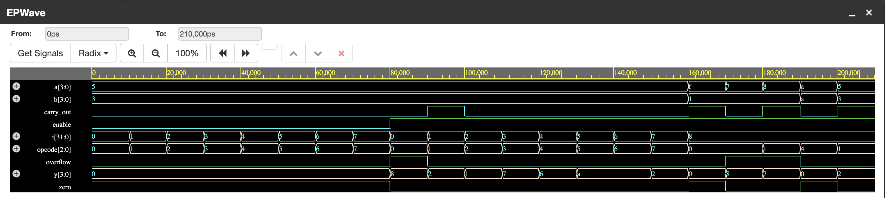
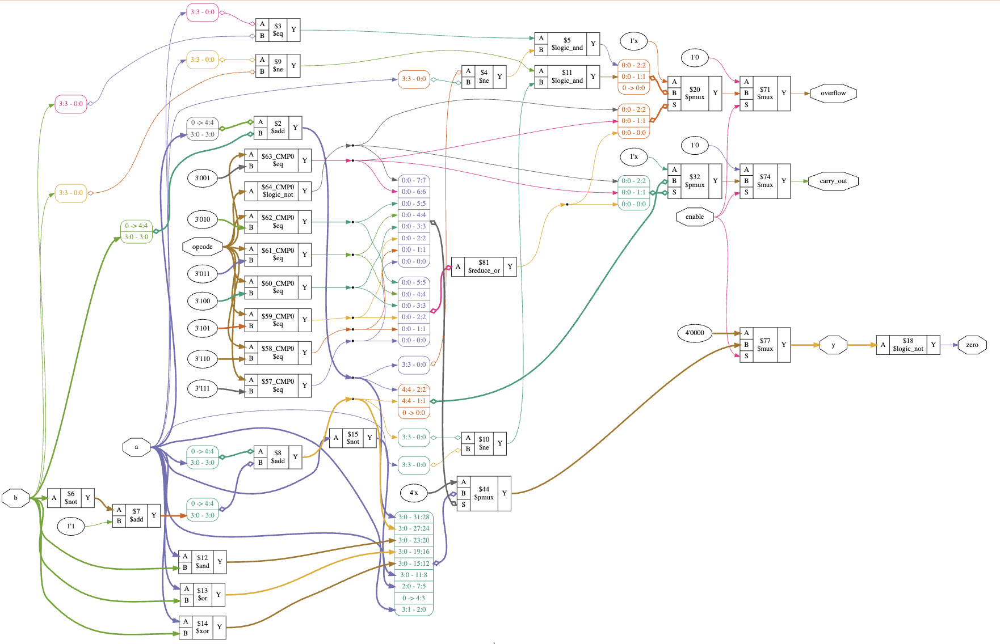

# 4-bit ALU with Status Flags (Verilog)

A 4-bit Arithmetic Logic Unit supporting 8 operations, with **Carry-out**, **Overflow**, and **Zero** status flags — the same kind of flag outputs found on real processor datapaths. Verified via simulation and synthesized to a gate-level netlist with Yosys.

## 📋 Supported Operations

| Opcode | Operation | Description |
|---|---|---|
| `000` | `y = a + b` | Addition — sets `carry_out` and `overflow` |
| `001` | `y = a - b` | Subtraction (2's complement) — sets `carry_out` and `overflow` |
| `010` | `y = a & b` | Bitwise AND |
| `011` | `y = a \| b` | Bitwise OR |
| `100` | `y = a ^ b` | Bitwise XOR |
| `101` | `y = ~a` | Bitwise NOT of `a` |
| `110` | `y = a << 1` | Logical left shift |
| `111` | `y = a >> 1` | Logical right shift |

When `enable = 0`, the output is forced to `0000` regardless of opcode.

## 🚩 Status Flags

- **`carry_out`** — set on unsigned overflow for addition (bit beyond MSB), or acts as a "no borrow" indicator for subtraction.
- **`overflow`** — signed overflow, computed as: for addition, both operands share a sign and the result's sign differs from theirs; for subtraction, operands have different signs and the result's sign differs from the minuend's.
- **`zero`** — set whenever the result `y` is `0000`.

## 🧪 Verification

The design was verified in two stages:

1. **Simulation** (Icarus Verilog, via EDA Playground) — the testbench sweeps all 8 opcodes, then exercises targeted corner cases: unsigned carry-out (`1111 + 0001`), positive signed overflow (`0111 + 0001`), negative signed overflow (`1000 − 0001`), and the zero flag (`a XOR a`). All results matched expected values.

   

2. **Synthesis** (Yosys) — the design was synthesized to a gate-level netlist to confirm it is fully synthesizable RTL, not just simulatable behavioral code.

   

## 🛠️ Running It Yourself

Requires [Icarus Verilog](http://iverilog.icarus.com/):

```bash
iverilog -o alu_sim alu.v alu_tb.v
vvp alu_sim
```

This prints a time-stamped trace of every signal to the console and writes `alu.vcd`, which can be opened in GTKWave (or EPWave on [EDA Playground](https://www.edaplayground.com/)) to inspect the waveform.
